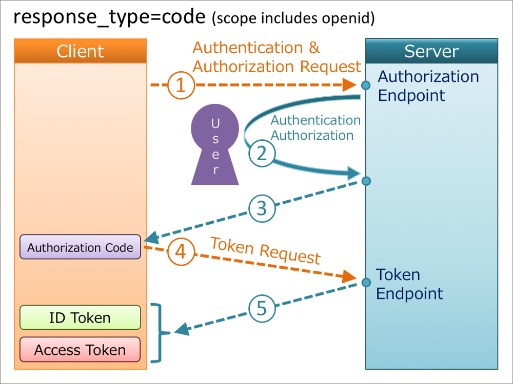

## 用户ID 认证-OIDC

## 身份认证

每当某个应用程序需要你的个人信息来确定你到底是谁,你必须把你的名字,电话号码,电子邮件等等输入到应用程序中然后确认你的身份。有必要这样做吗？

比如，当你打开掘金的登录时，你会发现其他登录方式有微博，微信，Github。假设你已经在浏览器已经登录过微博的话，这时你点击其他登录方式的“ Github”，掘金就会通过时用 OAuth2.0 协议向 Github 发送请求，请求一个 access_token，然后就会弹出以下对话框。


OAuth2.0 协议仅仅只是一种用户身份验证的方法，其通过一个 IDP（identity provider 身份提供者）获取到身份然后登录到第三方应用上。所以它是如何获取到我的用户信息呢？

那么 OIDC（OpenID Connect） 就发挥作用了。使用 OIDC，第三方应用就可以通过用户授权后从身份提供者（IDP）上安全的获取到用户信息。用户只需要点击几下就可以提供获取其详细身份。

## 什么是 OIDC

简单来说，OIDC就是一种安全的机制，它能够让一个应用通过一种安全的方式连接到身份提供者（OP），从 IDP 上获取到相关用户信息，然后返回给应用。它是建立在 OAuth2.0 协议之上身份层。这意味着，在授权服务中包含终端用户的基本信息时， OIDC 允许客户端应用通过授权服务执行认证，从而来验证终端用户身份。如果想了解学习更多关于 Oauth2.0 协议的，可以查看之前的[OAuth2.0 笔记](https://juejin.cn/post/7058121657147195399)。

在 OIDC 中，有一个额外的令牌 ，称为 ID Token ，是发布给客户端的。它是授权给客户端获取用户信息的。这是在 Oauth2.0 授权过程中的一个额外步骤。客户端应用在进行授权码请求时参数 scope 将会包含 openid，然后 IDP 认证这个请求再返回 2个 JWT，一个是 access_token 来自 OAuth2.0，一个是 id_token，来自 OIDC。

- ID Token 断言用户身份
- Access Token 可选择的，存储认证后的用户信息

主要包含的实体：

- End-User : 使用客户端和 OP 的所有者，相当于是在 OAuth2.0 资源所有者。
- Relay Party（RP）客户端应用从 OP 上请求 End-User 授权和 请求
- OpenId Provider(OP)  Oauth2.0 认证服务，实现 OIDC ，能够对 End-User 进行身份认证，也能够对 RP 响应关于授权和End-User的请求。

## ID Token

这个数据结构是OpenID连接的扩展使OAuth 2.0协议使终端用户身份验证。ID Token 类似身份证的概念在标准数字格式,rp可以验证。是一个包含关于JWT验证一个终端用户的授权服务器或OP

ID Token 符合RFC 7519行业标准并由以下三个部分：

- Header  头部，包含 token 类型和 token 所使用的算法
- Body(payload) 负载， 包含一个用户的身份声明。
- Signature 签名，OP 的签名，签名将会被 RP用于验证真实性

以下是 ID Token payload 部分：

```
{
 "iss": "http://test.nanlv.com",
 "sub": "248289761231",
 "aud": "s6BhdRkqt3",
 "nonce": "n-0S6_WzA2Mj",
 "exp": 1311281970,
 "iat": 1311280970,
 "name": "KanChaiGong",
 "given_name": "一名砍柴工",
 "family_name": "Kan",
 "gender": "female",
 "birthdate": "0000-10-31",
 "email": "Kan@nanlv.com",
 "picture": "http://example.com/nanlv/me.jpg"
}
```

- iss （Issuer Identifier）发行人标识的，即签发者
- sub（subject Identifier）jwt 所面向的用户，主题
- aud（Audience）接收 jwt 的一方，受众
- exp（） ID Token 过期时间
- iat   ID Token签发的时间
- nonce 随机值，主要是为减少重放攻击，是个可选项。

IDToken 的 payload  里也可以包含其他自定义的字段。为了保证 IDToken真实性，ID Token 必须由 OP 使用 JWT 签名。

## OIDC 认证流程

接下来，就是 OIDC 的不同认证方式的流程如何工作。

OIDC 执行身份验证过程是为了让 End-User 登录或确定 End-User是否已登录。然后 OIDC 将身份验证结果安全地返回给 RP。 此验证结果包含在返回的 ID Token 中，并且包含上面提到的 Claims。

OAuth2.0 授权框架中提供了这些协议中使用的授权 Web API 的定义。此 API 需要 response_type 作为强制请求参数。 OIDC 认证流程是根据  response_type 参数值的 code ，toke ，id token 组合定义的。

 OIDC 的三种认证方式，主要根据响应类型 response_type 划分：

- 授权码模式
  - response_type = code
  - 该模式是基于传统的 Oauth2.0 模式设计的
- Implicit模式
  - response_type = id_token
  - response_type = id_token token
- Hybrid 模式
  - response_type = code token
  - response_type = code id_token
  - response_type = code id_token token

#### 授权码模式

> response_type = code

该模式时基于传统的 OAuth 模式。



### Implicit模式

> response_type = id_token
> 
> response_type = id_token token

### Hybrid 模式

> response_type = code token
> 
> response_type = code id_token
> 
> response_type = code id_token token

参考资料：

- https://medium.com/@ashend/authenticated-user-id-an-introduction-to-openid-connect-7dd22c6f7479
